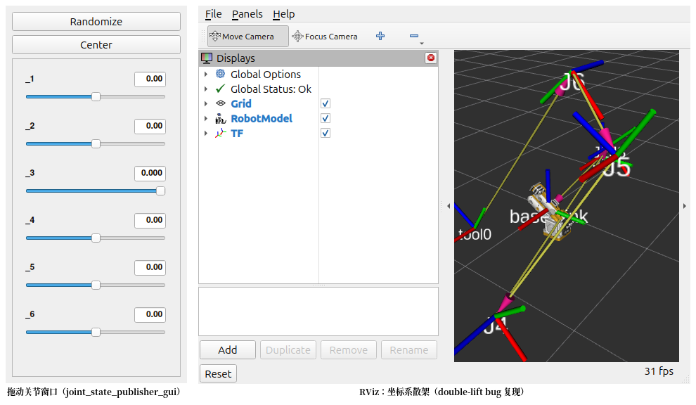
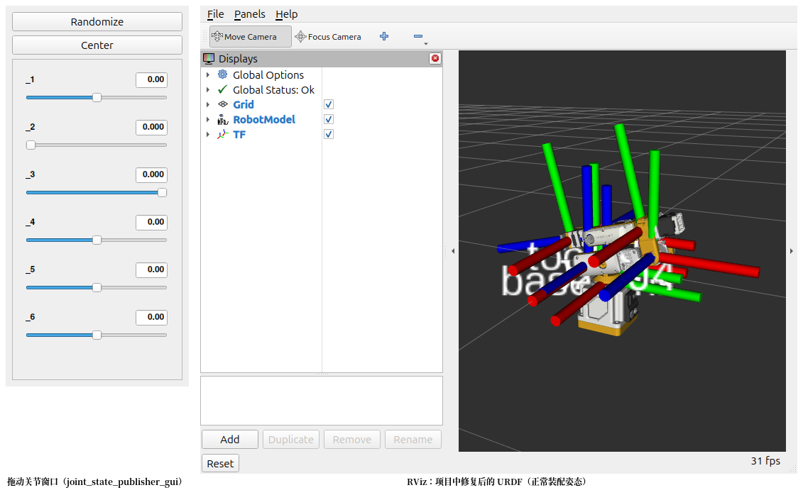

# fusion2URDF (Root-Joint Fixed 修复增强版)

[](https://github.com/BohnChen/fusion2URDF-root-joint-fixed/actions/workflows/test.yml)
[](LICENSE)
[](https://www.python.org/)
[](https://docs.ros.org/)
[](https://www.autodesk.com/products/fusion-360/)

**基于 [Adriaeik/fusion2URDF](https://github.com/Adriaeik/fusion2URDF) (v3.1.0) 的增强修复版。**

本仓库专注于解决机械臂、轮式底盘及多连杆复杂装配体在导出 URDF/ROS 2 包时，经常出现的**根组件关节原点米级虚假偏移、网格解构散架、关节帧错位（Double-Lift Bug）**问题，并完整保留了原版强大的分层 Xacro 宏、六种碰撞网格策略、闭环机构支持以及开箱即用的 `ros2_control` 支持。

---

## 核心修复说明 (Root-Owned Joint Double-Lift Fix)

### 问题背景
在 Fusion 360 中设计机械臂（如 Dummy 系列机械臂）或整机装配体时，常见的建模方式是将各构件作为 Occurrence 放置在根设计中，关节（Joint）直接由顶层根组件定义。

在上游原版代码的树构建阶段，Phase 1 提取的根组件下关节 `geometryOrOrigin` 实际上**已经是根/世界坐标系下的绝对坐标**。然而后续逻辑未区分定义组件是否为根组件，默认将其视作子/父 Occurrence 的局部坐标，再次通过位姿矩阵做了一次变换（**Double-Lift**），导致：
- **关节原点坐标叠加了额外的装配变换，产生 0.5m ~ 1.1m 以上的虚假平移**；
- 模型网格在 RViz 中严重错位、各部件相互脱节分离；
- 导出的旋转轴与实际几何旋转中心严重偏移。

### 修复前后对比 (Before vs After)

| 原版导出 (Double-Lift 导致关节虚假平移、网格散架) | 本仓库修复版 (消除重复变换，关节与几何精准对齐) |
| :---: | :---: |
|  |  |
| ❌ 关节原点偏移 0.5~1.1m，各轴悬空解体 | ✅ 关节帧与 CAD 严格重合，轴向残差 < 1.6mm |

### 修复方案
我们在 `core/robot_model.py` 的 `_compute_joint_global_origin` 逻辑中引入了自适应判定：
```python
# 0b) Root-owned joints: Fusion reports geometryOrOrigin* in the root
# frame, which IS the world frame. Lifting through the child/parent
# occurrence would double-apply its pose. One/Two agreement is the discriminator:
if (
    edge.defining_component == snapshot.design_name_clean
    and fj.geometry_or_origin_one_cm is not None
    and fj.geometry_or_origin_two_cm is not None
    and max(
        abs(a - b)
        for a, b in zip(fj.geometry_or_origin_one_cm, fj.geometry_or_origin_two_cm)
    ) < 1e-6
):
    return fj.origin_global_m
```
- **保守安全**：仅当“定义组件等于根组件”且“几何原点两侧一致（差值 < 1e-6）”时生效，直接采用世界原点，消除重复变换。
- **完全兼容**：所有嵌套子装配体或常规局部关节场景不受影响，继续回退走原版变换流程。
- **经过验证**：在 6 自由度 DummyArm 机械臂实物 CAD 及官方全套单元/流水线测试中均 100% 通过（旋转轴残差 < 1.6mm，网格对齐零拉扯）。

---

## 快速上手与安装

### 1. 安装脚本到 Fusion 360

#### macOS:
打开终端，将本仓库通过软链接加入 Fusion 360 脚本目录（后续 git pull 可自动同步）：
```bash
git clone https://github.com/BohnChen/fusion2URDF-root-joint-fixed.git ~/fusion2URDF
ln -s ~/fusion2URDF "$HOME/Library/Application Support/Autodesk/Autodesk Fusion 360/API/Scripts/fusion2URDF"
```

#### Windows:
将仓库克隆至本地，复制或建立目录联接（mklink）到：
`%APPDATA%\Autodesk\Autodesk Fusion 360\API\Scripts\fusion2URDF`

### 2. 在 Fusion 360 中一键导出
1. 打开定义好 Joint 的机器人装配体。
2. 快捷键 `Shift + S` 打开 **实用程序 (Utilities) -> 脚本和附加模块 (Scripts and Add-Ins)**。
3. 在 **脚本 (Scripts)** 标签页的“我的脚本”中找到 **fusion2URDF**，点击 **运行 (Run)**。
4. 选择导出保存的文件夹，等待导出完成。

### 3. ROS 2 构建与可视化

```bash
# 将导出的 <robot>_description 复制到 ROS 2 工作空间的 src 目录
cd ~/ros2_ws
colcon build --packages-select <robot_name>_description
source install/setup.bash

# 启动 RViz 预览（自带 joint_state_publisher 与 ros2_control）
ros2 launch <robot_name>_description display.launch.py
```

---

## 功能图解与深度使用指引

### 1. 一键全自动导出与多策略碰撞体

一键导出 6 自由度机械臂与平行夹爪，无需在导出前修改 CAD 模型。工具支持在同一模型内混合使用多种碰撞体策略：


- **基元拟合（Primitive）**：基于包围盒自动拟合高效的 Box、Cylinder、Sphere。
- **凸包碰撞（Convex Hull）**：从视觉网格顶点计算紧凑轻量的 STL 凸包。
- **高精度碰撞（Accurate）**：保留关键触面（如夹爪指尖）的完整几何网格。

### 2. 真实物理惯性矩阵与坐标系推导

导出器直接读取 Fusion 360 中的材料属性与质心，在刚性组展平与 bake offset 补偿后，精确输出物理求解器真正需要的惯量张量：


> 上图左侧为各连杆真实的惯性长方体分布，右侧为生成的连杆坐标系与旋转轴向。

### 3. 闭环连杆机构支持 (Closed-Loop Kinematics)

针对平行四边形、四连杆抓手、Stewart 平台等闭环结构，URDF 树结构无法直接表达循环依赖。本工具能够：
1. 自动识别运动链闭环；
2. 构建合法的树状 URDF 主分支；
3. 将闭环约束关节自动导出至 `robot_data.yaml`，便于在 Isaac Sim、MuJoCo 等物理引擎中作为闭环物理副重连。


### 4. 坐标系重定向 (Frame Rebaser)

默认情况下，根连杆遵循 Fusion 世界坐标系（X 轴向前，Z 轴向上），旋转关节绕局部 +Z 轴旋转。工具在导出后提供了 `tools/reframe.py` 与 `config/frame_overrides.csv`，无需重新打开 Fusion 即可直接调整关节朝向：

```bash
python tools/reframe.py <path-to-robot_description>
```


---

## Fusion 内命名标记速查 (`!`-tags)

直接在 Fusion 360 的浏览器树中给部件、实体或关节重命名添加前缀，即可精确调控导出行为：

| 标记 / 前缀 | 作用对象 | 效果说明 |
|---|---|---|
| `!acc_*` | 组件 / 刚性组 | 强制采用高精度原视觉网格作为碰撞体（适合夹爪手指） |
| `!cxh_*` | 组件 / 刚性组 | 强制生成凸包碰撞网格 |
| `!pri_*` | 组件 / 刚性组 | 强制自动拟合几何基元（长方体/圆柱体） |
| `!` (实体前缀) | 实体 (Body) | 标记为“仅视觉”（如天线、螺钉、铭牌），不参与碰撞体包围计算 |
| `!frame_*` | 组件 | 虚拟连杆坐标系（无质量/碰撞），用于设定工具末端（TCP）或定位基准 |
| `!passive_*` | 关节 (Joint) | 被动关节，`ros2_control` 仅保留状态反馈，不生成命令接口 |
| `!closing_*` | 关节 (Joint) | 显式标记闭环约束副，排除在 URDF 树外并写入 `robot_data.yaml` |

---

## 导出包结构一览

<details>
<summary><b>点击展开完整输出目录树</b></summary>

```text
<output_dir>/
├── <robot>_description/
│   ├── urdf/
│   │   ├── <robot>.urdf.xacro           # 主入口 Xacro 文件
│   │   ├── assemblies/<asm>.urdf.xacro  # 模块化子装配体宏
│   │   └── <robot>.urdf                 # 扁平化 URDF（用于纯验证/非 ROS 环境）
│   ├── meshes/<assembly>/
│   │   ├── <link>.dae                   # Visual 网格 (DAE / OBJ)
│   │   └── <link>_collision.stl         # Collision 碰撞网格
│   ├── launch/display.launch.py         # RViz2 可视化启动文件
│   ├── config/joint_state.yaml
│   ├── config/ros2_controllers.yaml     # ros2_control 默认配置
│   ├── config/frame_overrides.csv       # 坐标系微调表
│   ├── rviz/display.rviz
│   ├── robot_data.yaml                  # 扩展物理属性与闭环关节信息
│   ├── docs/transforms.md               # 运动学齐次变换矩阵表 (KaTeX)
│   ├── package.xml
│   └── CMakeLists.txt
└── debug/
    ├── snapshot.json                    # Fusion 原生提取缓存
    └── frame_model.json                 # 离线重调坐标系模型缓存
```

</details>

---

## 配置文件定制

如需修改导出配置（如默认格式 DAE/OBJ、控制插件、碰撞体预设），可复制模版文件：
```bash
cp xacro_export.template.toml xacro_export.toml
```
编辑 `xacro_export.toml` 即可覆盖默认选项（该文件已在 `.gitignore` 中，不会影响版本库）。

---

## 单元测试

项目包含完备的离线测试套件，可直接本地运行验证：

```bash
# 运行全部测试
python run_tests.py
```

---

## 致谢

- 核心上游：[Adriaeik/fusion2URDF](https://github.com/Adriaeik/fusion2URDF) (感谢 Adrian Valaker Eikeland 打造的现代 ROS 2 导出器)
- 历史启发：[syuntoku14/fusion2urdf](https://github.com/syuntoku14/fusion2urdf)
- 模型提供：Husarion (Panther), GrabCAD (SpotMini, dOf 6-DoF Arm, Parallel Gripper)

---

## 许可证

本项目基于 [MIT License](LICENSE) 开源。
